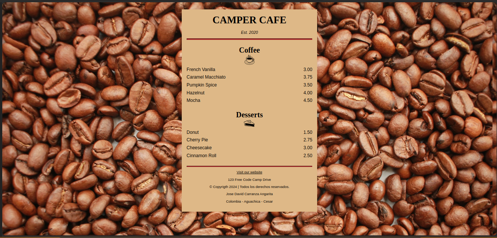

# Learn Basic CSS by Building a Cafe Menu - for freecodecamp.
In the following repository, we will find a web page designed with HTML and CSS based on what we learned in FreeCodeCamp’s Responsive Web Development certification.

